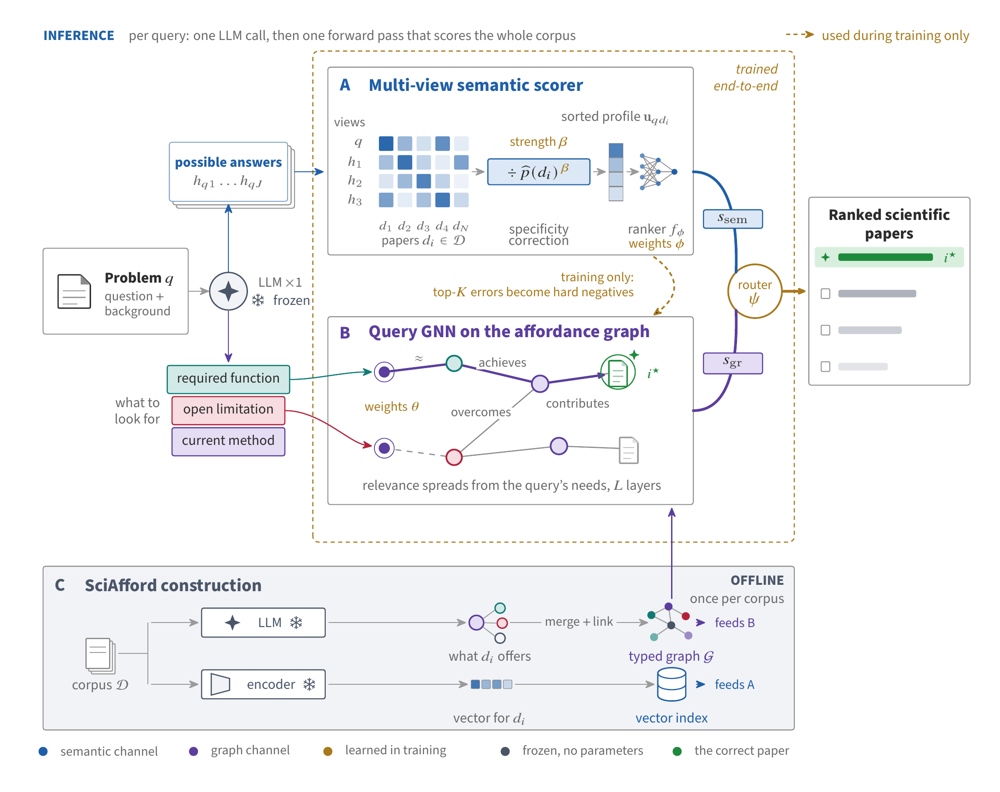

# SciGraphIR

**Scientific inspiration retrieval across research fields.** Given a research problem,
SciGraphIR ranks papers by how their contributions could help solve it. It combines a
multi-view semantic scorer with reasoning over the default SciAfford graph, which combines
affordance structure, OpenIE entity context and direct paper-to-affordance links.

This is the code accompanying the *SciGraphIR* MSc thesis, Imperial College London, 2026.

## Start here

| I want to… | Read |
|---|---|
| Understand the system and locate the thesis contributions | [Code guide](docs/README.md) |
| Prepare the environment and find the required data | [Setup and data](docs/SETUP.md) |
| Build a SciAfford graph | [Graph construction](sciafford/README.md) |
| Read the semantic scorer, CCMP, or fusion model | [Retriever](retriever/README.md) |
| Use the included SIR-4 dataset | [Dataset, splits and schema](sir-4/dataset/README.md) |
| Understand SIR-4 and EAID | [SIR-4 benchmark](sir-4/README.md) |
| Find a training notebook, baseline, or analysis | [Experiments](experiments/README.md) |
| Find the tables reported in the thesis | [Reported thesis results](experiments/results/THESIS_RESULTS.md) |

## Thesis contributions

| Contribution | What it adds | Implementation |
|---|---|---|
| **SciAfford** | Represents papers through their functions, limitations, mechanisms, and method relationships. | [sciafford/](sciafford/README.md) |
| **Multi-view semantic scorer** | Uses a document MLP for PMI-style specificity correction and a ranking MLP over the sorted answer-similarity profile. | [SortedMLPScorer and MatchabilityPredictor](experiments/eval/semantic_scorer.py) |
| **CCMP and adaptive fusion** | Supervises intermediate graph nodes, gates their messages, and combines graph and semantic scores. | [Engine contribution map](retriever/gfm-rag/SCIGRAPHIR_CHANGES.md) |
| **SIR-4 and EAID** | Constructs a four-field benchmark and searches for alternative valid inspiration sets for a fixed target. | [sir-4/](sir-4/README.md) |
| **Retrieval and downstream evaluation** | Tests retrieval, transfer, routing, and the quality of hypotheses composed from retrieved papers. | [experiments/](experiments/README.md) |

## How the system fits together

[](docs/figures/scigraphir-method.pdf)

*Method overview from the thesis.* A frozen LLM generates hypothetical answers and target
capabilities. The semantic and graph branches score candidate papers, and adaptive fusion
produces the ranking. Corpus representations are prepared offline.
[Open the vector PDF](docs/figures/scigraphir-method.pdf) to zoom into the original artwork.

Paper affordance representations and entity context are prepared offline.
[build_hybrid_graph.py](experiments/prep/build_hybrid_graph.py) assembles the default graph,
retaining `_hyb` in saved graph names. At query time, problem requirements, linked entities
and hypothetical answers provide the inputs to the two retrieval branches.

## Repository layout

```text
sciafford/            Affordance extraction and SciAfford graph construction
retriever/            Graph engine, answer generation, semantic inputs, dataset adapters
sir-4/                SIR-4 dataset, construction, EAID, resolution, and export
experiments/          Training notebooks, baselines, metrics, analyses, and result tables
docs/                Code guide and setup
scigraphir_paths.py   Shared dataset, graph, and cache paths
```

The learned semantic scorer currently lives in `experiments/eval/semantic_scorer.py`,
although it is part of the retrieval method. The [code guide](docs/README.md) traces
its dependencies on answer generation, encoding, and the graph engine.

## Running and reproducing experiments

Start with [setup and data](docs/SETUP.md), then the [SIR-4 preparation
runbook](experiments/RUNBOOK.md) and [notebook index](experiments/notebooks/README.md).
Training uses a GPU; the thesis workflows target Colab A100 runtimes.

The complete available **SIR-4 dataset is included** in [sir-4/dataset/](sir-4/dataset/README.md):
train/test corpora, queries, gold inspiration sets and export metadata for all four fields.
Unpack it without downloads or API calls:

```bash
python sir-4/prepare_data.py
python experiments/prep/stage_sir4.py --domain physics
```

The dataset guide records one difference from the thesis: the available Physics training
export has 3,087 queries rather than 3,120. Extraction caches, embeddings, checkpoints and
per-query predictions remain separate. Exact experiment reproduction also needs those run
artifacts; see [results and provenance](experiments/results/README.md).

## Citation and upstream code

Citation metadata is in [CITATION.cff](CITATION.cff). The graph engine is a fork of
[GFM-RAG / G-Reasoner](https://github.com/RManLuo/gfm-rag). Its
[change map](retriever/gfm-rag/SCIGRAPHIR_CHANGES.md),
[upstream revision](retriever/gfm-rag/VENDORED_COMMIT.txt), and
[Apache-2.0 license](retriever/gfm-rag/LICENSE) are retained with the fork.
