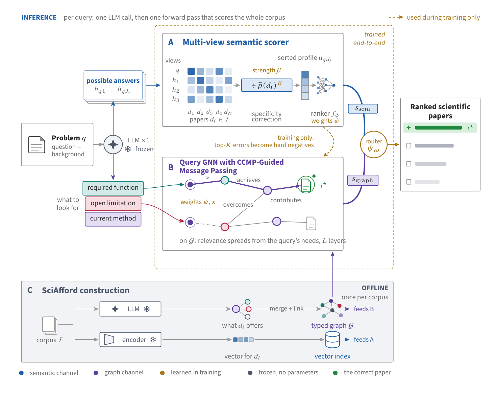

# SciGraphIR

Corpus-scale scientific inspiration retrieval with a knowledge-graph reasoning foundation
model. Given a research problem, SciGraphIR ranks every paper in a corpus by whether its
contribution could inspire a solution, including papers from distant fields that share no
vocabulary with the problem. It is trained on some scientific fields and applied unchanged
to fields it never saw.

This repository holds the code behind the MSc thesis *SciGraphIR* (Imperial College London,
2026). It is organised around the thesis contributions so a reader can go from a chapter to
the code that implements it.



## The system in one paragraph

Online, a query costs two short LLM calls and no candidate-wise inference: one call extracts
the problem's requirement frame (task, required functions, current methods, open
limitations) and one generates hypothetical answers. Two branches then score the whole
corpus. The **multi-view semantic scorer** compares each paper to every hypothetical answer
separately, divides each match by a learned estimate of how easily that paper matches
unrelated answers (a PMI-style specificity correction), and maps the sorted profile of
matches to a score with a small MLP. The **graph reasoner** propagates the query's
requirement frame over the offline **SciAfford** graph with a query-conditioned GNN
(QueryNBFNet, six layers); **CCMP** supervises its intermediate nodes with contrastive
continuation targets and gates their outgoing messages, so selective bridges transmit more
than generic hubs. A **query-adaptive router** fuses the two standardised scores:
`s_fused = z_sem + gamma_q * ReLU(z_graph)`, with `gamma_q = softplus(router(phi_q))`.
Everything expensive (frame extraction, embeddings, graph construction) runs once per corpus,
so cost grows as O(N + Q) rather than O(N Q).

## Contributions and where they live

| # | Contribution | Thesis | Code |
|---|---|---|---|
| 1 | **SciAfford**: affordance-lifted graph construction. Papers are lifted into field-neutral role-typed relations (function, limitation, mechanism, method lineage) instead of OpenIE entities. Holding the reasoner fixed and changing only the graph raises cross-domain Recall@5 on TOMATO-Star from 27.7 to 31.5 while same-domain moves 44.4 to 44.9. | Ch. 4 | [`sciafford/`](sciafford/README.md): `extract_frames.py` (Stage 1 paper frames and Stage 3 query frames), `build_greasoner_dataset.py` (Stage 2 merge and link, Stage 3 seed snapping). Controls and variants: `retriever/run_index.sh` (OpenIE graph), `experiments/prep/build_hybrid_graph.py` (merged graph). |
| 2a | **Multi-view semantic scorer** with answer-null (PMI-style) calibration. Learned exponent, so the uncalibrated scorer is a special case. Also supplies the hard negatives that train the graph. | Ch. 6 | [`experiments/eval/semantic_scorer.py`](experiments/eval/semantic_scorer.py) (`SortedMLPScorer` with the popularity predictor; arm `mlp`), `retriever/probes/gen_probes.py` (hypothetical answers), `retriever/eval/operator_scorer.py` (handcrafted operator, encoder and caches), `retriever/precompute/`. |
| 2b | **Contrastive Continuation Message Passing (CCMP)** and the query-adaptive fusion router. Document labels become layer-specific process supervision for intermediate nodes without annotated paths. | Ch. 7 | [`retriever/gfm-rag/`](retriever/gfm-rag/SCIGRAPHIR_CHANGES.md): `gfmrag/models/fusion_reasoner.py` (fusion, router, CCMP head), `gfmrag/trainers/fusion_trainer.py` (targets, losses, joint objective), `gfmrag/models/ultra/models.py` (CCMP gate, routing baselines), config `gfmrag/workflow/config/gfm_reasoner/sft_training_fusion.yaml`. |
| 3 | **SIR-4 and EAID**: a trainable four-field benchmark (computer science, biology, physics, materials science; 16,867 decomposed target papers, strict chronological split) and Equivalence-Aware Inspiration Decomposition, which searches for alternative validated inspiration sets instead of assuming one gold set (32 of 50 audited targets admitted an alternative). | Ch. 8 | [`benchmark/`](benchmark/README.md): `build/01_collect.py` to `05_export.py`; EAID in `build/03_new_method.py` and `build/03b_uniqueness.py`; validation criteria in `build/03_decompose.py`; `experiments/eval/score_sir4.py` (multi-gold metrics and CompleteSet@k). |
| 4 | **Downstream evidence**: better retrieval yields hypotheses closer to the true one, and reference-free pairwise judging penalises exactly that. | Ch. 9 | [`experiments/downstream/`](experiments/downstream/README.md) and the copied `tomato_star_analysis/` package. |
| Exp. | Main table, ablations, routing baselines (A*Net-style, RED-GNN-style), zero-shot transfer between fields and to ResearchBench and MIR, LLM-retrieval baselines, path interpretations. | Ch. 9 | [`experiments/`](experiments/README.md): `notebooks/`, `eval/`, `prep/`, `transfer/`, `llm_baselines/`, `results/`. |

## Repository layout

```
scigraphir/
|-- scigraphir_paths.py        path resolver: corpora, graphs and caches keyed by --dataset
|-- sciafford/                 1. SciAfford graph construction (frames, graph, query seeds)
|-- retriever/                 2. the retriever
|   |-- gfm-rag/               graph reasoning engine (GFM-RAG fork) with CCMP and the fusion router
|   |-- probes/                hypothetical-answer generation (one LLM call per query)
|   |-- eval/                  handcrafted operator: encoder, caches, warm start
|   |-- precompute/            semantic-branch inputs aligned to a graph, for training
|   |-- researchbench/         ResearchBench pool and domain labels
|   |-- tomato_star/           TOMATO-Star staging
|   |-- train/                 the original TOMATO-Star training notebook (template)
|   |-- run_index.sh           OpenIE control graph
|   `-- data/                  corpora and graphs (runtime, git-ignored)
|-- experiments/               staging, scorer, metrics, notebooks, analyses, results
|   |-- RUNBOOK.md             one dataset through the whole pipeline, command by command
|   |-- prep/                  stage_sir4.py, stage_mir.py, run_domain.py, bundle.py, notebook generators
|   |-- eval/                  score_sir4.py, semantic_scorer.py, audit_graph.py, baselines, figures, path analyses
|   |-- notebooks/             the Colab notebooks that produced the thesis tables
|   |-- transfer/              ResearchBench zero-shot protocol and paired bootstrap
|   |-- llm_baselines/         MOOSE-Chem, MOOSE-Star and LATTICE on SIR-4
|   |-- downstream/            4. hypothesis composition and judging
|   |-- colab_cells/           paste-in Colab cells used by the analysis notebooks
|   `-- results/               final tables (tex, md) and qualitative analyses
|-- benchmark/                 3. SIR-4 benchmark construction and EAID
`-- docs/figures/              thesis figures used in these READMEs
```

Each directory has a README that says what is inside.

## Data and reproducibility

The repository holds code, configurations, evaluation scripts and the final tables. The data
is distributed separately and unpacks onto the repository root:

| What | Where it comes from | Path after unpacking |
|---|---|---|
| **SIR-4 benchmark** (four fields, train and test corpora, queries, every validated inspiration set) and the LLM extraction caches (paper and query frames, hypothetical answers) that let the graphs be rebuilt without an API key | `scigraphir-data-sir4.zip` on the Releases page of this repository, built with `experiments/prep/make_release_data.py` | `retriever/data/sir4_*`, `sciafford/cache/sir4_*`, `retriever/probes/cache/sir4_*`, `benchmark/data/benchmark/*` |
| TOMATO-Star, MIR and ResearchBench | the original benchmark releases; `retriever/tomato_star/`, `experiments/prep/stage_mir.py` and `retriever/researchbench/` stage them into the same layout | `retriever/data/{tomato,mir,researchbench}_*` |
| Built graphs, embeddings, checkpoints, per-query predictions | regenerated by the pipeline and the notebooks (graphs rebuild byte-identically from the caches); trained checkpoints are available on request | `retriever/data/*_v16sc`, `outputs/` |

To reproduce a principal result: unpack the data zip at the repository root, run steps 3 and 4
below for the field (no LLM calls are needed once the caches are present), and run the matching
notebook from `experiments/notebooks/`; `experiments/eval/score_sir4.py` produces the same /
cross nDCG@5, Recall@k and CompleteSet@k columns of the tables.

## Running the pipeline

Graph construction and scoring run locally; training runs on one A100 through the notebooks.
`experiments/RUNBOOK.md` gives the full sequence for one dataset; in outline:

```bash
export SCIGRAPHIR_ROOT=$(pwd)               # optional locally, required on Colab
export OPENAI_API_KEY=...                   # frame extraction, hypothetical answers, LLM baselines

# 0. stage a corpus (SIR-4 export -> retriever/data/<dataset>_<split>/raw/)
python3 experiments/prep/stage_sir4.py --domain physics

# 1. SciAfford frames for papers and queries (paid, resumable)
cd sciafford && for s in test train; do for side in doc query; do
  python3 extract_frames.py --dataset sir4_physics --side $side --split $s --workers 128; done; done; cd ..

# 2. hypothetical answers for the semantic branch (paid, small)
cd retriever && for s in test train; do
  python3 probes/gen_probes.py --dataset sir4_physics --split $s --workers 128; done; cd ..

# 3. build and audit the graphs (free)
cd sciafford && for s in test train; do
  python3 build_greasoner_dataset.py --dataset sir4_physics --split $s --tau_canon 0.95 --no_entity_seeds --no_probe_seeds; done; cd ..
cd experiments && for s in test train; do python3 eval/audit_graph.py --dataset sir4_physics --split $s --spread --sample 40; done

# 4. bundle for Colab and generate the training notebook
python3 prep/bundle.py --dataset sir4_physics && python3 prep/build_notebook.py --domain physics --batch 1
```

`experiments/prep/run_domain.py` drives steps 0 to 4 idempotently for one or all fields and
gates the paid steps behind `--spend`. On Colab the notebook fits the semantic scorer,
precomputes its components, trains the fusion with CCMP, and scores with
`experiments/eval/score_sir4.py` (Recall@k, MRR, nDCG@5, CompleteSet@k, same / cross strata).

Training settings (thesis Section 9.1): frozen Qwen3-Embedding-0.6B encoder; QueryNBFNet with
six 1,024-dimensional layers, DistMult messages, sum aggregation, trained from scratch; AdamW,
learning rate 5e-4, batch size 4, 10 epochs, bfloat16, seed 1024; candidate pools of all golds,
the top-50 hard negatives of each branch and 50 random negatives; CCMP with 64 reachable
semantic errors sampled from 256, the 512 highest-confidence gold- and error-favouring nodes
per query and layer, `eta = 0.5`, `lambda_CCMP = 1.0`.

## Results snapshot (nDCG@5, %)

From `experiments/results/main_table/main_results_thesis_2026-09-13.tex`, the table as it
stands in the thesis (all baselines; `main_results.tex` next to it is the 8 September build).

| Method | TOMATO-Star same / cross | SIR-4 CS same / cross | Biology | Physics | Materials | MIR |
|---|---|---|---|---|---|---|
| Qwen3-Embedding (best dense) | 30.61 / 14.82 | 38.50 / 35.10 | 61.60 / 48.10 | 58.30 / 51.10 | 52.60 / 44.10 | 27.47 |
| ReasonIR-8B | 30.90 / 16.60 | 37.50 / 33.20 | 56.90 / 46.60 | 57.00 / 45.00 | 48.10 / 42.30 | 27.67 |
| G-Reasoner (OpenIE graph) | 18.10 / 6.60 | 24.50 / 22.50 | 32.50 / 31.90 | 33.40 / 25.30 | 30.90 / 26.60 | 15.68 |
| Multi-view semantic scorer | 32.33 / 22.01 | 37.37 / 34.91 | 63.04 / 50.33 | 59.01 / 53.35 | 53.14 / 47.33 | 30.93 |
| + graph reasoner (SciAfford graph) | 34.56 / 24.74 | 37.04 / 34.91 | 63.92 / 52.05 | 59.50 / 53.26 | 53.99 / 48.49 | 31.58 |
| + CCMP (full SciGraphIR) | **34.86 / 25.05** | **38.90 / 36.70** | **64.17 / 53.21** | **59.59 / 53.76** | **55.20 / 49.53** | **31.68** |

Zero-shot transfer (`experiments/results/zeroshot_baselines/table_zeroshot_thesis_2026-09-13.tex`):
trained on Physics and Biology and applied unchanged, SciGraphIR scores 36.36 / 47.38 nDCG@5 on
the cross-field queries of Computer Science / Materials Science against 35.11 / 44.06 for the
best dense baseline, and trained on all four SIR-4 fields it leads ResearchBench (38.47 same,
32.88 cross) and MIR (31.80).

## Environment

- Python 3.10 or later. `pip install -r requirements.txt` for the local pipeline. The engine
  needs PyTorch and PyTorch Geometric, then `pip install -e retriever/gfm-rag`.
- Training and the graph-side analyses run on Colab (A100). The notebooks read the engine as
  `gfm-rag-adapted.zip` and the data bundle from Google Drive; `experiments/prep/bundle.py`
  makes the bundle and the generators in `experiments/prep/` make the notebooks.
- Environment variables: `SCIGRAPHIR_ROOT` (repository root; optional for local scripts,
  required by the engine and on Colab), `EXTERNAL_REPOS` (directory holding the third-party
  checkouts the baselines and the downstream study import: TOMATO-Star, MOOSE-Chem,
  MOOSE-Star, `llm-guided-hierarchical-search` for LATTICE, ResearchBench; default
  `external/`, git-ignored), `OPENAI_API_KEY`, `DEEPSEEK_API_KEY` (SIR-4 construction).
- Files in `experiments/colab_cells/` are paste-in Colab cells, not importable modules.

## Citation

See `CITATION.cff`. The engine is a fork of
[GFM-RAG / G-Reasoner](https://github.com/RManLuo/gfm-rag) (Apache-2.0); see
`retriever/gfm-rag/SCIGRAPHIR_CHANGES.md` for the exact changes.
