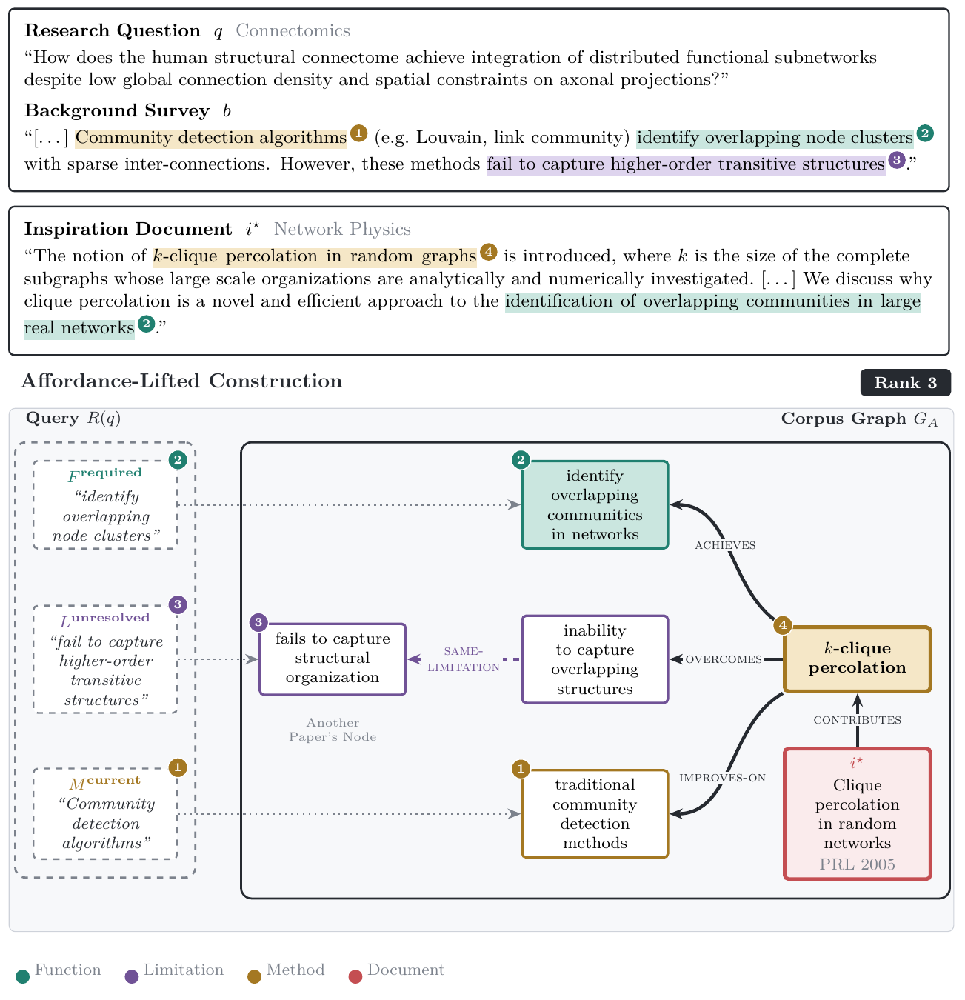

# SciAfford: affordance-lifted graph construction

This directory builds the knowledge graph that the SciGraphIR graph reasoner walks
(thesis Chapter 4). Instead of OpenIE entity triples, every paper is lifted into
**field-neutral, role-typed relations**: what a method *achieves* (function), which
*limitation* it overcomes, *how* it works (mechanism), and which methods it *builds on*
or *improves on*. A query is lifted the same way, so a research problem and a paper from
another field meet on shared function, limitation and mechanism nodes even when they
share no vocabulary.



## Three stages

| Stage | Script | What it does | Cost |
|---|---|---|---|
| 1. Paper frames | `extract_frames.py --side doc` | One schema-guided LLM call per paper (title + abstract) returning task, domain, contributions with `achieves` / `overcomes` / `mechanism` / `builds_on` / `improves_on`, task limitations, findings and causal findings. Resumable JSONL cache. | paid, once per corpus |
| 2. Corpus graph | `build_greasoner_dataset.py` | Converts frames to typed nodes and edges, merges near-duplicate nodes (BGE-large cosine at `--tau_canon`), adds typed similarity edges between mutual 8-nearest neighbours, and writes the graph in the engine's `stage1` layout. | free, local |
| 3. Query seeds | `extract_frames.py --side query` then `build_greasoner_dataset.py` | One LLM call per query extracts task, required functions, current methods and open limitations; each phrase is snapped to at most 3 same-type graph nodes with cosine at least 0.60 and becomes a start node. | one call per query |

Settings used in the thesis (Appendix, "Graph Construction Details"):

| Setting | Value |
|---|---|
| Extraction model | `gpt-4o-mini`, temperature 0.2, input truncated to 3,000 characters |
| Embedding model | `BAAI/bge-large-en-v1.5` |
| Near-duplicate merging | cosine >= 0.95 (`--tau_canon 0.95`; the script default is 0.85, so pass the flag) |
| Similarity edges | mutual 8-NN, cosine in [0.80, 0.995], type-specific relation names |
| Query seeding | top-3 nodes per phrase, cosine >= 0.60 |

## Node and edge grammar

```
paper  --contributes-->  method        method  --achieves-->   function
paper  --reports----->  finding       method  --overcomes-->  limitation
paper  --addresses--->  task          method | finding --works_via--> mechanism
paper  --in_field---->  domain        task | method --limited_by--> limitation
finding --concerns--->  function      method | finding --builds_on | improves_on--> method
finding --explains--->  limitation
similarity edges: is_specific_case_of (function), is_variant_of (method), shares_purpose (task),
                  shares_mechanism (mechanism), same_limitation (limitation), corroborates (finding)
```

Node names carry their type as a prefix (`[function] partition an input into labeled
regions`); paper nodes are the document ids.

## Commands

Corpora live at `kg-construction/data/<dataset>_<split>/raw/{documents.json, <split>.json}`
(see `sir4-retrieval/prep/stage_sir4.py`). All paths resolve through `../cargo_paths.py`;
set `CARGO_ROOT` to the repository root when running from elsewhere.

```bash
export OPENAI_API_KEY=...          # or put it in kg-construction-v16/.env.local (git-ignored)
export CARGO_ROOT=/path/to/scigraphir
cd $CARGO_ROOT/kg-construction-v16

# Stage 1 and the query side of Stage 3 (paid, resumable)
for s in test train; do for side in doc query; do
  python3 extract_frames.py --dataset sir4_physics --side $side --split $s --workers 128
done; done

# Stages 2 and 3 (free)
for s in test train; do
  python3 build_greasoner_dataset.py --dataset sir4_physics --split $s --tau_canon 0.95 \
      --no_entity_seeds --no_probe_seeds
done
```

Outputs: `kg-construction/data/<dataset>_<split>_v16sc/processed/stage1/{nodes.csv, edges.csv,
relations.csv, <split>.json}`. Audit them with `sir4-retrieval/eval/audit_graph.py`
(dangling edges, zero-seed queries, hub nodes, one-hop gold reachability).

## Other files

- `make_noent_dataset.py` derives the no-entity-seed variant of a built graph without
  rebuilding it (TOMATO-Star seed ablation).
- `../sir4-retrieval/prep/build_hybrid_graph.py` builds the merged-graph variant
  (`*_hyb`): the SciAfford graph plus the query's OpenIE entity seeds, entity-to-paper
  mention edges and paper-to-frame shortcut edges.
- `../kg-construction/run_index.sh` builds the OpenIE entity graph with the stock engine
  indexer. It is the construction control ("+ Graph Reasoner (OpenIE graph)" row).
- `cache/` holds the frame JSONL caches and concept embeddings (git-ignored).

The directory name is historical: this was the sixteenth construction iteration of the
project, and the Colab bundles reference it by this name.
